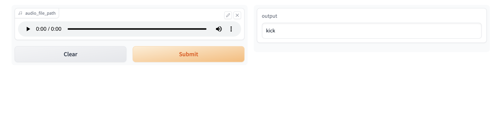

<link rel="stylesheet" href="/style.css" />

# 12-04-2023: Drum Sample Categorization

[Try live application](https://huggingface.co/spaces/mr-lizard/drum-sample-categorization)

Recently I have been working through [Practical Deep Learning for Coders](https://course.fast.ai/) and this project is culmination of my learning from the first two lessons.

The first lesson of the course covers setting up the environment for deep learning and provides an introduction to the FastAI library. In this lesson you train a model to recognize between two different types of  image. The second lesson focuses on how to create a user facing application using a pretrained model, [gradio](https://gradio.app/) (a library for building web UI's with python) and [Hugging Face Spaces](https://huggingface.co/spaces) (a platform for hosting machine learning applications).

To train the model, I created a Jupyter notebook using that uses [librosa](https://librosa.org/doc/latest/index.html) to create a spectogram image for each audio file. I then used these images to train a machine learning model to recognize which type of drum each of these samples belogned to. You can see the notebook on google collab [here](https://colab.research.google.com/drive/1A0GDZAcmBueE_V0fDs6M0PRdXkOdEgzN?usp=sharing).

To build the application I created another notebook along with nbdev to write the application in a literate style (see [literate programming](https://en.wikipedia.org/wiki/Literate_programming)). You can view the HTML version of the notebook [here](./drum_sample_categorization.html). Please note that the application wont work through this link as it's just a static page without a backend

I used Hugging Face Spaces to host the application. The finished application can be accessed [here](https://huggingface.co/spaces/mr-lizard/drum-sample-categorization). It should be noted that the model may have difficulty distinguishing between some samples, as it was not trained on a sufficient number of drum samples. The next steps will be to retrain the model on a larger selection of drum machine samples to improve the accuracy of the models predictions.